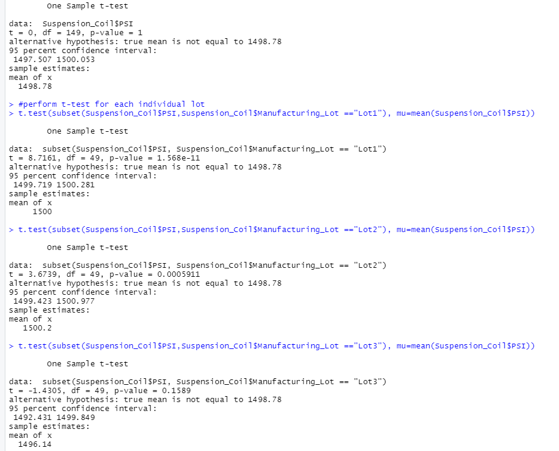

# MechaCar_Statistical_Analysis
## Overview 
The purpose of this analysis is to review the production data for insights that may help the manufacturing team by doing the following:
- Perform multiple linear regression analysis to identify which variables in the dataset predict the mpg of MechaCar prototypes
- Collect summary statistics on the pounds per square inch (PSI) of the suspension coils from the manufacturing lots
- Run t-tests to determine if the manufacturing lots are statistically different from the mean population
- Design a statistical study to compare vehicle performance of the MechaCar vehicles against vehicles from other manufacturers. 

---
## Results
### Linear Regression to Predict MPG
- The following variables/coefficients provided a non-random amount of variance to the mpg values in the dataset:
  - Vehicle length = 2.60e-12
  - Ground clearance = 5.21e-8
- The slope of the linear model can not be considered to be zero because the p-value (5.35e-11) is lower than our lowest level of significance. This means we must reject the null  
- The model does predict that the mpg of the MechaCar effectively since the r-sqaured shows that the model is 71% accurate
-

### Summary Statistics on Suspension Coils
- Although the total summary data shows a variance under 100 pounds per square inch, Lot 3's (170.29) variance is well over that acceptable variance. So in total, the data does meet specifications, but lot 3 indivudually does not.

### T-Tests on Suspension Coils
- For all manufacturing lots, the p-value is above our significance level so we do not have sufficient evidence to reject the null hypothesis. Therefore, the two means are statistically similar.
- For Lot 1, the p-value is far below our significance level. Therefore we must reject the null hypothesis. The two means are statistically different.
- For Lot 2, the p-value is also lower than our significance level, so we must reject the null hypothesis. The two means are statistically different.
- For Lot 3, the p-value is above our significance level so we do not have enough evidence to reject the null hypothesis. Therefore, the two means are statistically sismilar.

---
## Study Design: MechaCar vs Competition
- A metric I think would be important is city/highway fuel efficiency compared to competitors.
- Null Hypothesis: MechaCar prototypes average fuel efficiency is similar to competitors with the same vehicles.
- Alternative Hypothesis:MechaCar's prototypes average fuel efficiency is statistically above or below their competitors.
- I would use a one-sample t-test based on our null and alternative hypothesis.
- I would need data on fuel efficiency from MechaCar prototypes and it's competitors. 
